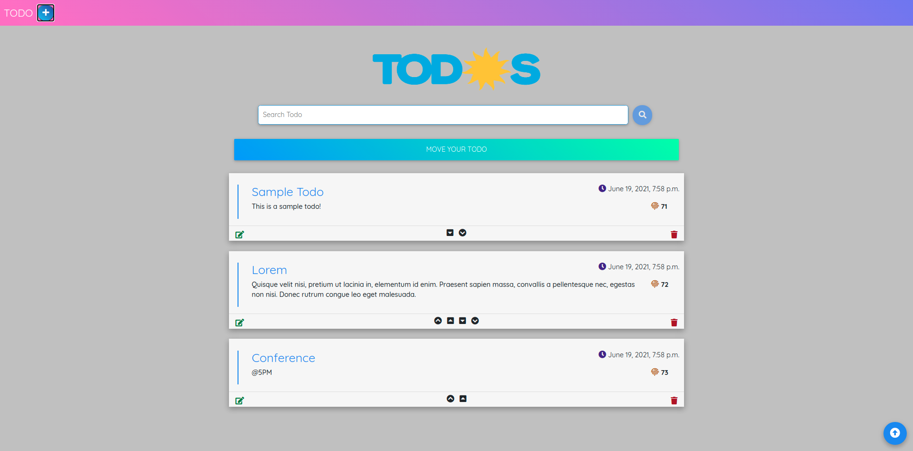

## Moving Todo
A simple todo application where you can manage todo entries.
Most importantly you can move each todo entry to any position you want.
The project is based on:
- simple django api backend is used for database management
- HTML, CSS, JS, AJAX for UI management



### Installation guide
Clone the project in your storage and `change directory` to the project
```shell script
git clone https://github.com/kiranparajuli589/Moving-Todo.git
```

#### Setup virtual environment
```shell script
python -m venv myenv
source myenv/bin/activate
```
#### Install requirements
```shell script
pip install -r requirements.txt
```

#### Sql table creation
```shell script
python manage.py makemigrations
python manage.py migrate
```

#### Create super user
```shell script
python manage.py createsuperuser
```

#### Localhost
```shell script
python manage.py runserver
```

#### Check database through link:
http://127.0.0.1:8000/admin/todo/todo/
